### 2020/07/01: `pg_pool` benchmark added to test pool fairness changes

* Commit: 7c8ef602661c9cb62c8cf43aaf0f8faaf5b0aed5
* Machine specs:
    * (`lscpu`) Intel(R) Core(TM) i9-9900K CPU @ 3.60GHz
    * 64 GB DDR4 RAM
    * (Distro / `uname -a`) Arch Linux / kernel `5.6.15-zen2-1-zen`
    * (`rustc -V`) `rustc 1.43.0-nightly (834bc5650 2020-02-24)`
* Command: `cargo bench --features runtime-tokio,postgres -- --measurement-time 30`

| Connections | Unfair Pool | Fair Pool|
|-------------|-------------|----------|
| 5 | 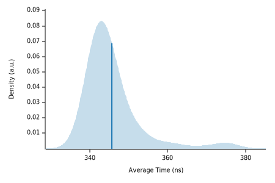  | 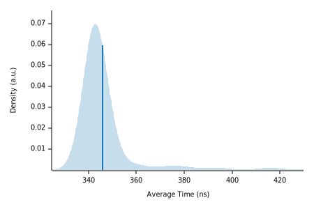 |
| 10 | 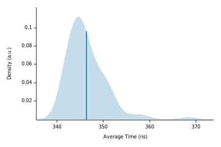  | 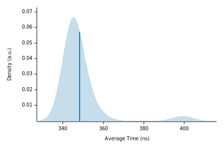 |
| 50 | 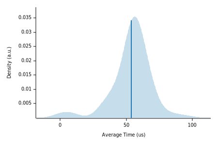  | 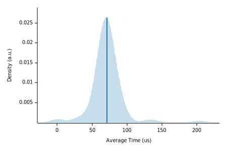 |
| 100 |   |  |
| 500 | 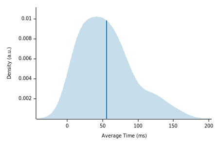  | 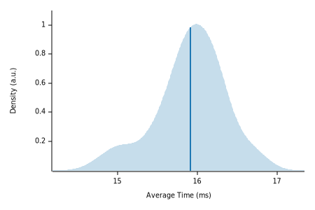 |
| 1000 | 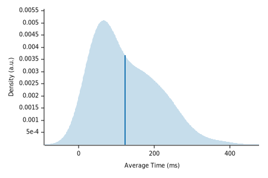  | 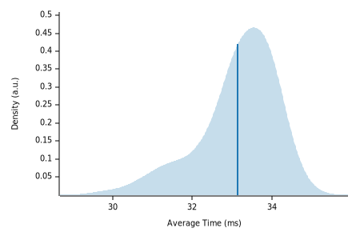 |
| 5000 | 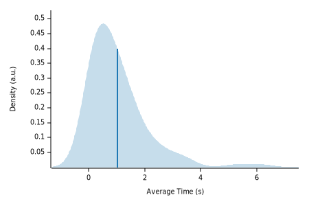  | 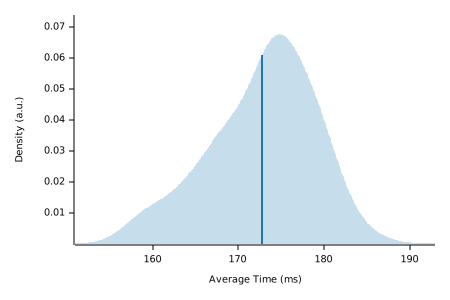 |

When the pool is set to be fair it appears the average time for `acquire()` at high contention
(500+ tasks using 50 pool connections) actually goes down by up to an order of magnitude since tasks 
in the waiter queue aren't getting preempted.

This appears to be the solution to our problem of tasks timing out waiting for a connection at high
load. At very low contention (5-10 tasks using 50 pool connections), the average time for `acqure()`
increases by perhaps 10% but a difference between 80µs and 90µs is hardly noticeable in real 
applications.

A normal MPMC channel may care about that kind of overhead, though, which is why most implementations
aren't perfectly fair.
